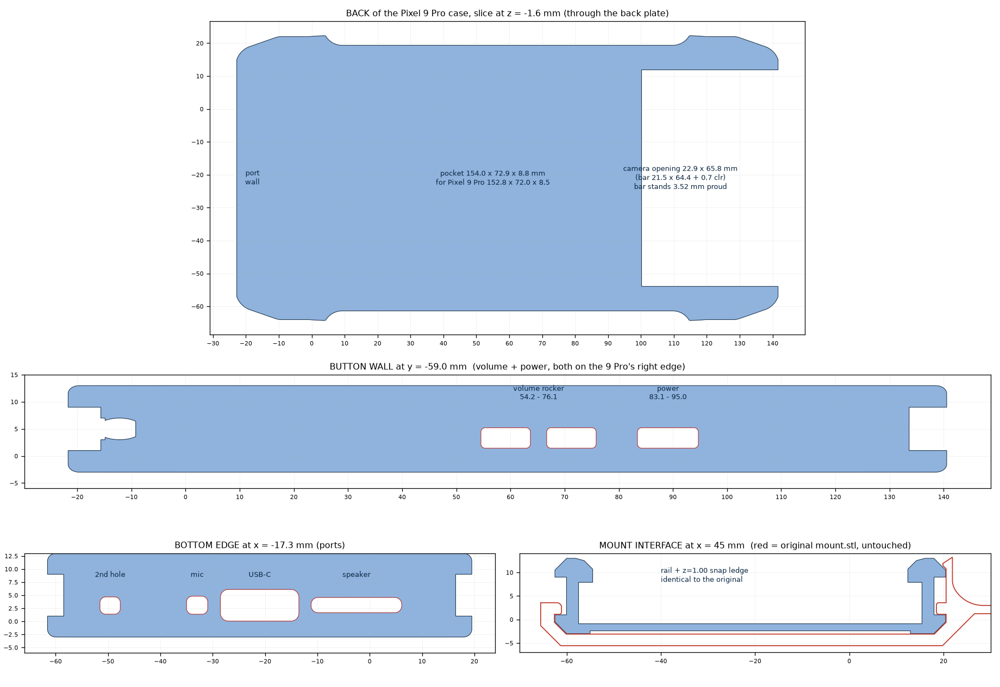
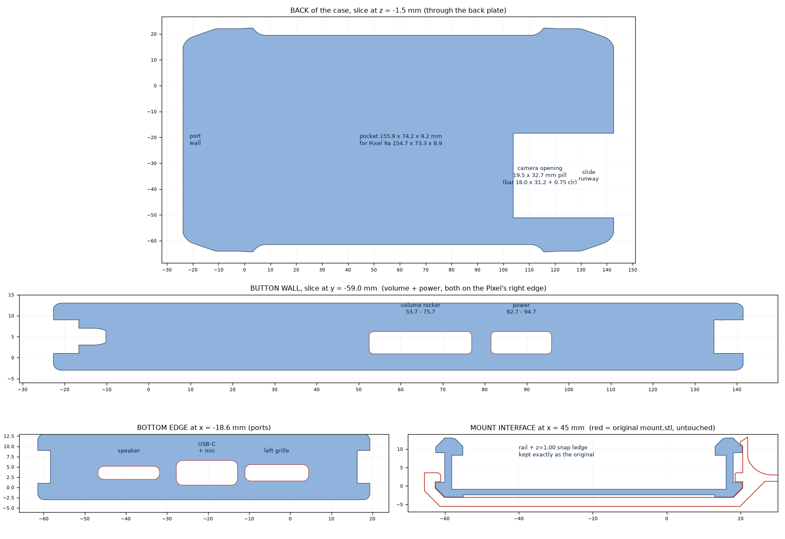
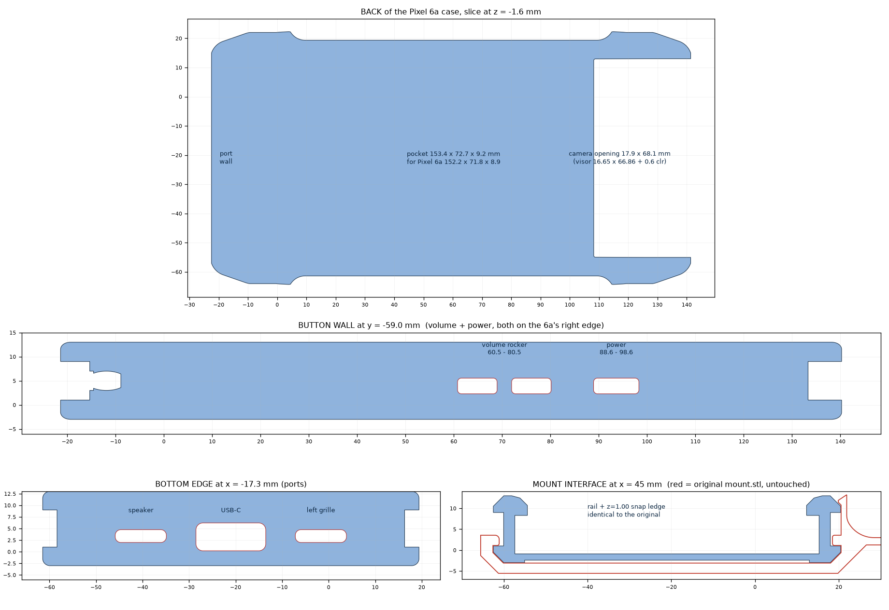

# Juggernaut-style MOLLE case — Pixel 9 Pro, Pixel 9a and Pixel 6a

Three 3D-printable rugged phone cases that drop into the **unmodified** MOLLE adapter from
msenturk115's *Juggernaut Tactical MOLLE Phone Case*, which was drawn around a Galaxy S8.

Each case was rebuilt around a real 3D model of the phone. Every fit — the adapter, the phone,
the end caps, the button plungers — is verified by boolean intersection, not by eye.
**One printed adapter takes any of the three.**

| | Pixel 9 Pro | Pixel 9a | Pixel 6a |
|---|---|---|---|
| phone | 152.80 × 72.00 × 8.50 mm, R 12.00 | 154.70 × 73.30 × 8.90 mm, R 12.03 | 152.20 × 71.79 × 8.90 mm, R 5.2–5.4 |
| camera | 64.4 × 21.5 mm bar, **3.52 mm proud** | 31.2 × 18.0 mm pill, 0.6 mm proud | 66.9 × 16.7 mm visor, 1.5 mm proud |
| case | 164.43 × 86.59 × 19.00 mm | 166.34 × 86.59 × 17.60 mm | 163.83 × 86.59 × 17.20 mm |
| pocket | 154.00 × 72.90 × 8.80 mm | 155.90 × 74.20 × 9.20 mm | 153.40 × 72.69 × 9.20 mm |
| side wall | 2.55 mm | 1.90 mm | 2.66 mm |
| stretch vs. the S8 original | +3.50 mm | +5.40 mm | +2.90 mm |





## What's here

```
pixel-9-pro/   pixel-9a/   pixel-6a/      7 STLs + NOTES.md + preview renders
   assembly/                              coloured, fully assembled model (OBJ + 3MF)
shared-mount/                             mount.stl, molle.stl, molle_mount.stl -- ORIGINAL, UNMODIFIED
source/                                   the parametric build + verification scripts
*.zip                                     every STL above in one archive
```

Read each kit's `NOTES.md` for exactly what changed and why.

## Printing

Back (−Z) on the plate, PETG or ABS/ASA, 4 perimeters, 30 % infill or more.

Print the two button plungers first, drop them into their recesses **from inside the pocket**,
then take the top cap off and slide the phone in from the top — the phone traps the plungers.
Use `bottom_cap_for_usb_cable_*` instead of `bottom_cap_*` when you want to charge with the
cap on. If the phone is tight after printing, scale the case to 100.3 % **in X and Y only**.

## How the mount interface is preserved

The adapter grips the case through four spring tabs that hook over a horizontal ledge at
**z = 1.00 mm** in the groove running along both sides of the case. Those tabs sit at
x 36.9–56.9 and 61.9–82.0, with a 4.98 mm tab-free window at x 56.95–61.93.

All three cases therefore keep, untouched:

* outer rail faces y = −62.48 / +20.45, rail underside z = −3.00, and the 45° chamfers
* the side groove (in to y = −60.02 / +17.98, z 1.00 – 9.00) and its z = 1.00 snap ledge
* the groove rib, re-trimmed after the stretch back to x 57.44 – 61.44 so it stays inside the
  tab-free window
* the T-slots at both ends that the end caps slide into

Each case is lengthened by splitting the original at x = 59.5 — inside that tab-free window —
and inserting a slice of its own constant mid-section, so the rail pattern the adapter sees is
unchanged. The button plungers stop at y = −60.95, clear of the tab tips at y = −61.10.

## The camera bump is what makes each case different

The phone has to slide in lengthways with the top cap off, and the camera has to travel with
it. How proud the camera sits dictates the whole back of the case:

* **9a** — 0.6 mm. A 0.70 mm channel in the pocket floor, with a small boss outside to keep the
  plate 1.4 mm.
* **6a** — 1.5 mm. Too deep for a 1.5 mm back plate, so a raised visor shelf carries the channel.
* **9 Pro** — 3.52 mm. A 3.60 mm-proud camera shelf, which is the only reason that case is
  1.4 mm thicker than the other two.

Because that channel must run out through the top-cap socket, each **top cap carries a tongue**
that plugs the trench it would otherwise leave. Shaped by boolean — the trench box minus the
case and the phone, each grown 0.20 mm — so it cannot foul either, and measured against the
stock cap over a full 26 mm withdrawal it adds **+0.0000 mm³** of interference.
See `pixel-9-pro/preview/topcap_gap_before_after.png`.

## Verified

For all three phones, by boolean intersection (0.000 mm³):

* case ∩ mount.stl — the adapter still seats
* case ∩ phone, seated and at every extreme of the clearance envelope
* the phone slid in from the +X end in 2 mm steps over the full length, at each corner of the
  clearance envelope
* case ∩ and phone ∩ each of the four caps and both button plungers
* every phone feature — speaker, USB-C, mic(s), camera, buttons — unobstructed
* every STL: one body, watertight

Re-run it yourself: see `source/`.

## Rebuilding

```bash
pip install numpy trimesh manifold3d shapely
export JUGG_ROOT=/path/to/work      # holds the extracted original zip + the phone models
python source/pixel9pro/build_case9p.py && python source/pixel9pro/build_parts9p.py
python source/pixel9a/build_case.py   && python source/pixel9a/build_parts.py
python source/pixel6a/build_case6a.py && python source/pixel6a/build_parts6a.py
python source/pixel9pro/topcap_fill.py   # adds the top-cap tongues to all three
python source/finalize.py                # decimate to 5 um and re-verify everything
python source/assembly.py                # coloured assembled models
```

Every dimension lives in `source/<kit>/params*.py`.

## Credit and licence

The original **Juggernaut Tactical MOLLE Phone Case** is by **msenturk115**. The MOLLE adapter,
the end caps, and the case's outer shell and rail geometry are their work; this repo only
refits the phone-facing side for three Pixels. Please check the original model's licence before
selling anything printed from this, and credit msenturk115.

The phone reference models are third-party and are **not** redistributed here — only
measurements taken from them:

* Pixel 9 Pro — `pixel_9_pro.stl` by the1dynasty, [Thingiverse 6746749](https://www.thingiverse.com/thing:6746749)
  (cross-checked against the Pixel 9 Pro XL STEP by Sri Ram on GrabCAD)
* Pixel 6a — `Pixel6AModel.3mf` / `.step`
* Pixel 9a — `pixel9a-phone.stl`
